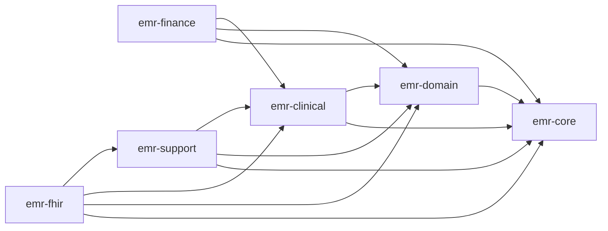

# Health MR

병원·의료기관의 전자의무기록(EMR) 업무를 다루는 백엔드 포트폴리오 프로젝트입니다.

현재는 `java_backend`의 Java 25/Spring Boot 멀티모듈 구현을 중심으로 개발하고 있으며, 향후 동일한 도메인과 외부 API 계약을 기반으로 NestJS 버전을 별도 백엔드로 추가할 예정입니다.

## 구현 현황

| 구현             | 상태    | 설명                                               |
| ---------------- | ------- | -------------------------------------------------- |
| Java/Spring Boot | 개발 중 | 도메인별 멀티모듈 EMR 백엔드와 FHIR R4 연계 어댑터 |
| NestJS           | 계획    | Java 버전을 대체하지 않는 별도 구현으로 추가 예정  |

두 구현은 프레임워크 구조를 억지로 동일하게 맞추지 않습니다. 환자·진료·검사·진단·처방 등 핵심 개념과 외부 API 계약은 비교할 수 있게 유지하되, Spring과 NestJS 각각의 생태계에 자연스러운 구조를 사용합니다.

## 주요 기능 영역

| 영역            | 설명                                                             |
| --------------- | ---------------------------------------------------------------- |
| 임상            | 예약, 접수, 진료, 처방, 입원, 진료 통계와 AI 기반 분석           |
| 재무            | 수가·진료비, 결제, 계약, 비급여 항목과 자격 연동                 |
| 운영 지원       | 게시판, 근태, 휴가·휴직, 장비 연동, 건강검진과 검사              |
| 공통 도메인     | 사용자, 환자, 부서, 기관, 인증과 메시지                          |
| 의료정보 연계   | 기존 EMR 데이터를 6개 FHIR R4 리소스로 제공하는 읽기 전용 어댑터 |
| 분석 파이프라인 | Python과 ClickHouse 기반의 추출·적재·검증·재처리                 |

## 저장소 구조

```text
Health_mr/
├── README.md
├── java_backend/              # 현재 Java/Spring Boot 구현
│   ├── emr-core/
│   ├── emr-domain/
│   ├── emr-clinical/
│   ├── emr-finance/
│   ├── emr-support/
│   ├── emr-fhir/
│   └── pipeline-python/
└── nest_backend/              # 향후 NestJS 구현 예정
```

NestJS 버전은 실제 구현을 시작할 때 `nest_backend` 같은 별도 디렉터리에 둡니다. 현재 단계에서는 미래 구조를 위한 빈 모듈이나 공통 추상화 패키지를 미리 만들지 않습니다.

## Java 백엔드

### 기술 스택

- Java 25
- Spring Boot 4.0.x
- Gradle Kotlin DSL
- Spring Web, WebFlux, Security, Data JPA, Validation, Redis
- QueryDSL, JWT, Jasypt, Apache POI, ModelMapper
- HAPI FHIR R4
- JUnit 5, Mockito, RestAssured
- MySQL, PostgreSQL, ClickHouse

### 모듈 구성

| 모듈           | 역할                                                         |
| -------------- | ------------------------------------------------------------ |
| `emr-core`     | 보안, 락, 감사, 파일, 알림과 공통 기술 기능                  |
| `emr-domain`   | 사용자, 환자, 부서, 기관, 인증과 메시지                      |
| `emr-clinical` | 예약, 접수, 진료, 처방, 입원과 임상 통계                     |
| `emr-finance`  | 진료비, 수가, 결제, 계약과 자격 연동                         |
| `emr-support`  | 근태, 게시판, 검사, 장비와 운영 지원                         |
| `emr-fhir`     | 기존 EMR 데이터를 FHIR R4로 변환하는 최외곽 읽기 전용 어댑터 |

### 의존 방향



`emr-fhir`는 기존 모듈을 읽는 외곽 연계 계층입니다. 기존 엔티티를 FHIR 형태로 변경하거나 기존 모듈이 `emr-fhir`에 의존하도록 만들지 않습니다.

### FHIR R4 지원 범위

- `Patient`
- `Practitioner`
- `Encounter`
- `Observation`
- `Condition`
- `MedicationRequest`
- 단건 읽기와 최소 검색
- 검색 결과 `Bundle(type=searchset)`
- 오류 응답 `OperationOutcome`
- LOINC, KCD와 내부 약품 코드 표현

현재 목적은 범용 FHIR 서버 구축이 아니라 기존 EMR 데이터를 표준 FHIR R4 표현으로 제공하는 것입니다. HAPI JPA Server, 전체 FHIR CRUD, 이력, 고급 검색, 별도 FHIR 저장 모델과 커스텀 IG는 요구가 생기기 전까지 도입하지 않습니다.

Java 백엔드의 상세 실행 방법과 API 범위는 [`java_backend/README.md`](java_backend/README.md)를 참고하세요.

## 향후 NestJS 버전 방향

NestJS 버전은 다음 원칙으로 진행할 예정입니다.

- Java 버전과 동일한 EMR 문제 영역을 별도 구현으로 제공
- Java 패키지·계층을 TypeScript에 그대로 복제하지 않음
- NestJS module, provider, guard, pipe 등 프레임워크 관례 활용
- API 계약과 FHIR 리소스 의미는 가능한 범위에서 Java 버전과 비교 가능하게 유지
- DB 스키마와 데이터 공유 여부는 구현 시작 시 마이그레이션 책임과 운영 목적을 기준으로 결정
- 양쪽 구현 사이의 공통 라이브러리나 코드 생성은 실제 중복 비용이 확인될 때만 도입
- FHIR 기능은 NestJS에서도 내부 도메인과 분리된 외곽 연계 모듈로 구성

초기 NestJS 범위는 환자·진료·검사 같은 핵심 흐름부터 시작하고, Java 버전의 모든 기능을 한 번에 복제하지 않습니다.

## Java 빌드 및 실행

요구 사항:

- JDK 25
- Gradle Wrapper 사용 권장

```powershell
cd java_backend
.\gradlew.bat build
```

모듈별 실행 예시:

```powershell
.\gradlew.bat :emr-clinical:bootRun
.\gradlew.bat :emr-finance:bootRun
.\gradlew.bat :emr-support:bootRun
.\gradlew.bat :emr-fhir:bootRun
```

데이터소스, Redis, JWT와 외부 API 설정은 각 애플리케이션 설정 파일 및 환경 변수에 맞춰 구성해야 합니다.

## 개발 원칙

- 기존 모듈 구조와 도메인 소유권을 우선 유지합니다.
- 확인되지 않은 미래 요구를 위해 모듈·포트·추상 계층을 미리 만들지 않습니다.
- 외부 프로토콜 모델을 내부 엔티티에 침투시키지 않습니다.
- 순환 의존, JPA Lazy Loading 또는 N+1 문제가 실제로 확인될 때 해당 조회 경로만 분리합니다.
- Java와 NestJS 구현은 계약과 도메인 의미를 공유하되 각 프레임워크에 자연스러운 구조를 선택합니다.

## 라이선스 및 버전

- Java group: `com.sleekydz86`
- 현재 버전: `0.0.1-SNAPSHOT`
- Java Gradle root project: `my-java-multimodule`
- 라이선스: [`LICENSE`](LICENSE)
