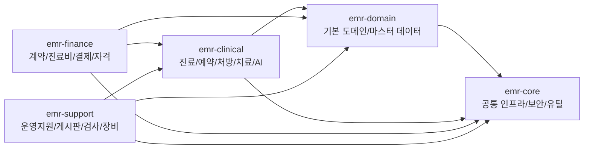

# Health MR Java Backend

`java_backend`는 의료/EMR(전자 의무 기록) 업무를 멀티모듈로 분리한 Spring Boot 기반 백엔드입니다.  
공통 보안/인프라 기능은 `emr-core`에 두고, 기본 도메인 기능은 `emr-domain`, 진료 업무는 `emr-clinical`, 정산/계약은 `emr-finance`, 운영 지원 업무는 `emr-support`로 나누어 구성되어 있습니다.

## 프로젝트 개요

- 공통 인프라: 보안, JWT, 파일 업로드/다운로드, Excel 입출력, 알림, 감사 로그, 분산락, 스케줄링
- 기본 도메인: 사용자/기관/부서/환자/메시지/인증
- 진료 영역: 예약, 처방, 치료, 체크인, 진료 통계, 약품/행정처분 공공 API 연계, AI 분석/추천
- 재무 영역: 계약, 진료비, 비급여 진료비 API 연계, 자격 조회, 결제 및 통계
- 지원 영역: 근태, 게시판, 장애인 복지, 의사 진료 관리, 장비, 검사/검사일지, 건강검진 기관, 휴일/휴무

## 모듈 구조



## 모듈별 역할

### `emr-core`
공통 인프라와 횡단 관심사를 담당하는 모듈입니다.

- 보안/인증: Spring Security, JWT 필터, 토큰 블랙리스트, 세션 관리, 입력값 검증
- 데이터 보호: 암호화, 마스킹, 감사 로그
- 운영 기능: 비동기 이벤트, 스케줄링, JPA Auditing, QueryDSL 설정
- 파일 처리: 업로드/다운로드, 저장소, Excel import/export
- 기타: 이메일 알림, 알림 템플릿, 분산락, 멱등성 처리, 공통 유틸

주요 패키지:

- `com.sleekydz86.core.audit`: 감사 로그 저장/조회
- `com.sleekydz86.core.config`: 보안, 웹, JPA, QueryDSL, 비동기/크론 설정
- `com.sleekydz86.core.file`: 파일 저장/업로드/다운로드, Excel 처리
- `com.sleekydz86.core.lock`: 분산 락, 멱등성 처리
- `com.sleekydz86.core.notification`: 메일/알림 발송 및 템플릿
- `com.sleekydz86.core.security`: JWT, 세션, 암호화, 마스킹, 검증
- `com.sleekydz86.core.utils`: 날짜/문자열/파일/숫자/변환 유틸

### `emr-domain`
기본 비즈니스 도메인과 마스터 데이터를 담당하는 모듈입니다.  
이름은 `domain`이지만 순수 엔티티 모듈에 가깝기보다, 인증/사용자/환자/기관/부서/메시지 API와 서비스까지 포함하는 업무 중심 모듈입니다.

주요 기능:

- 인증/인가: 로그인, 로그아웃, 회원가입, 토큰 재발급, 비밀번호 재설정
- 사용자/조직 관리: 사용자, 기관, 부서
- 환자 관리: 등록, 조회, 검색, 중복 검사, 환자번호 생성
- 메시지: 메시지 전송, 읽음 처리, 통계

주요 패키지:

- `com.sleekydz86.domain.auth`: 인증 API, 요청/응답 DTO, 세션/계정잠금/리프레시 토큰
- `com.sleekydz86.domain.common`: `BaseEntity`, 공통 리포지토리/서비스, 테넌트 리스너, 값 객체
- `com.sleekydz86.domain.department`: 부서 관리
- `com.sleekydz86.domain.institution`: 기관 관리
- `com.sleekydz86.domain.message`: 메시지 도메인 서비스, 팩토리, 전략, 통계
- `com.sleekydz86.domain.patient`: 환자 엔티티, 검색, 번호 생성기, 중복 검사
- `com.sleekydz86.domain.user`: 사용자 프로필/권한/승인 관리

### `emr-clinical`
진료 현장 업무와 AI 기반 부가 기능을 담당하는 모듈입니다.

주요 기능:

- 예약 관리: 예약 등록/수정/취소/조회
- 처방 관리: 처방 생성/수정/취소/조회, 처방 통계
- 치료 관리: 외래/입원/응급 치료, 치료 완료 처리, 치료 통계
- 접수/체크인
- 약품 정보/행정처분 공공 API 연계
- AI 진료 보조: 이상 탐지, 환자 이력 분석, 치료 추천, 의사 추천, 스케줄 최적화, 보고서 생성
- 외부 데이터 기반 진료 통계 import

주요 패키지:

- `com.sleekydz86.emrclinical.ai`: AI 분석/추천/리포트 API
- `com.sleekydz86.emrclinical.checkin`: 체크인 처리
- `com.sleekydz86.emrclinical.prescription`: 처방, 약품 API, 통계, 알림
- `com.sleekydz86.emrclinical.reservation`: 예약, 예약 알림
- `com.sleekydz86.emrclinical.treatment`: 치료, 외래/입원/응급, 통계, 공공 데이터 import
- `com.sleekydz86.emrclinical.config`: 진료 모듈 전용 설정

외부 연동:

- 의약품 정보 API
- 의약품 행정처분 API
- 입원/진료 통계 파일 import (`xls`, `csv`)

### `emr-finance`
재무/정산/계약/자격조회 관련 기능을 담당하는 모듈입니다.

주요 기능:

- 계약 및 계약 중계 관리
- 진료비/수가/진료 유형 관리
- 비급여 진료비 Open API 연계 및 동기화
- 시술코드 통계/분석
- 결제 등록/완료/환불/취소/배치/검증/통계
- 건강보험/의료급여/기초생활수급 등 자격 조회

주요 패키지:

- `com.sleekydz86.finance.contract`: 계약/계약 중계
- `com.sleekydz86.finance.medicalfee`: 진료비, 의료유형, 비급여 API 연계, 통계
- `com.sleekydz86.finance.payment`: 결제 처리, 정산, 배치, 검증, 통계
- `com.sleekydz86.finance.qualification`: 보험/복지 자격 조회
- `com.sleekydz86.finance.config`, `common`, `type`: 모듈 공통 설정 및 타입

외부 연동:

- 비급여 진료비 공공 API
- 시술코드 CSV 기반 통계 import

### `emr-support`
병원 운영지원성 업무를 담당하는 모듈입니다.

주요 기능:

- 근태/휴가/휴무/공휴일 관리
- 게시판/댓글/조회 통계
- 장애 등록 및 장애인 돌봄기관 추천/검색
- 의사 진료 이력 관리
- 장비 관리, 장비 연동, 장비 사용 이력
- 검사 관리, 검사 일정/결과/혈액은행/검사일지 관리
- 건강검진 기관 데이터 import 및 추천

주요 패키지:

- `com.sleekydz86.support.attendance`: 근태/휴가/통계
- `com.sleekydz86.support.board`: 게시판, 댓글, 통계
- `com.sleekydz86.support.disability`: 장애/돌봄기관 추천 및 import
- `com.sleekydz86.support.doctortreatment`: 의사 진료 업무
- `com.sleekydz86.support.equipment`: 장비, 장비연동, 장비일지
- `com.sleekydz86.support.examination`: 검사/검사일지/결과/일정/혈액은행
- `com.sleekydz86.support.healthcheckup`: 건강검진 기관 import/추천
- `com.sleekydz86.support.holiday`, `recess`: 휴일/휴무 관리

외부 연동:

- 건강검진 기관 CSV import
- 장애인 돌봄기관 CSV import

## 패키지 설계 특징

이 프로젝트는 전통적인 `layered architecture`와 `feature package`를 혼합한 구조에 가깝습니다.

- 모듈 수준: `core / domain / clinical / finance / support`로 업무 영역 분리
- 패키지 수준: 각 업무 패키지 안에 `controller / dto / service / repository / entity`를 함께 배치
- 공통 처리: 보안, 파일, 알림, 잠금, 스케줄링 등은 `emr-core`로 집중
- 비즈니스 확장: 통계, 외부 API 연동, import 배치, 추천/알림 서비스가 각 업무 모듈 안에서 세분화

즉, `emr-core`는 플랫폼/인프라, `emr-domain`은 기본 업무 도메인, 나머지 3개는 업무 실행 모듈로 보는 것이 가장 자연스럽습니다.

## 실행 관점 정리

실행 가능한 애플리케이션 모듈:

- `emr-clinical`
- `emr-finance`
- `emr-support`

라이브러리 성격 모듈:

- `emr-core`
- `emr-domain`

Windows 예시:

```powershell
cd D:\intel\AISamples\Health_mr\java_backend
.\gradlew.bat :emr-clinical:bootRun
.\gradlew.bat :emr-finance:bootRun
.\gradlew.bat :emr-support:bootRun
```

## 한 줄 요약

이 저장소는 병원/EMR 업무를 `공통 인프라`, `기본 도메인`, `진료`, `재무`, `운영지원`으로 나눈 대형 멀티모듈 Spring Boot 백엔드입니다.
