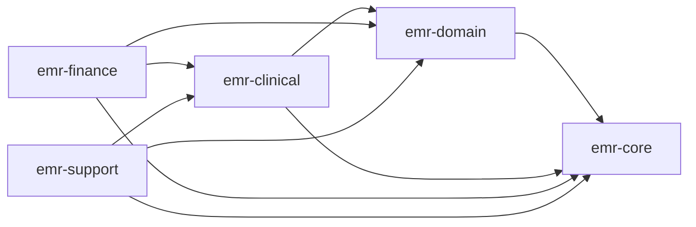

# Health MR Java

의료/EMR 멀티모듈 백엔드 `emr-core`, `emr-domain`, `emr-clinical`, `emr-finance`, `emr-support` 와 Python 파이프라인 `pipeline-python` 을 함께 운영하기 위한 개발 실행 기반입니다.

Healthcare_mr 포트폴리오 | 작성: 궁금하면500원

## 프로젝트 개요

운영 전담 인력이 제한된 환경에서 EMR 업무 진료 재무 운영지원 와 분석 파이프라인을 안정적으로 운영하기 위한 모듈형 백엔드 구조입니다.

- 공통 인프라/보안은 `emr-core`로 집중
- 기본 도메인 인증 환자 사용자 기관 은 `emr-domain` 으로 분리
- 업무 실행 모듈은 `emr-clinical`, `emr-finance`, `emr-support`
- 통계/분석 성격 데이터는 ClickHouse 연계, 운영 데이터는 MySQL/PostgreSQL 중심

## 핵심 요구사항

- 모듈 분리 기반의 유지보수성 확보
- 실행 모듈 독립 배포 가능 구조
- 외부 공공 API/파일 import 배치 처리
- 로컬 개발에서 관측 스택 Prometheus Grafana Loki Promtail 포함 실행 가능

## 기술 스택

| 영역              | 선택                       | 이유 요약                               |
| ----------------- | -------------------------- | --------------------------------------- |
| 백엔드 프레임워크 | Spring Boot Java 21        | 멀티모듈 운영, 계층 구조, 표준 생태계   |
| 데이터 액세스     | Spring Data JPA + QueryDSL | 복잡 조회/통계 쿼리 대응                |
| 캐시/락           | Redis                      | 세션/토큰/분산락                        |
| 분석 저장소       | ClickHouse                 | 통계성 조회 처리                        |
| 컨테이너          | Docker + Docker Compose    | 로컬 통합 개발환경                      |
| 메트릭            | Prometheus + Grafana       | 표준 관측 조합                          |
| 로그              | Loki + Promtail            | 경량 로그 파이프라인                    |
| CI/CD             | GitHub Actions 권장        | 모듈별 자동 빌드 테스트 파이프라인 용이 |

## 모듈 의존 구조



## 디렉토리 구조

```text
backend/
├── app/
│   ├── architecture.drawio
│   ├── docker-compose.yml                 # 로컬 통합 실행기
│   └── observability/
│       ├── prometheus.yml
│       ├── loki-config.yml
│       ├── promtail-config.yml
│       └── grafana-datasources.yml
├── emr-core/                               # 공통 보안/인프라/유틸
├── emr-domain/                             # 인증/환자/사용자/기관 등 기본 도메인
├── emr-clinical/                           # 예약/처방/치료/통계/AI
├── emr-finance/                            # 계약/진료비/결제/자격조회
├── emr-support/                            # 근태/게시판/검사/장비/건강검진
├── pipeline-python/                        # Python 분석 파이프라인
├── build.gradle.kts
└── settings.gradle.kts
```

## 빠른 시작

### 1. 모듈 단독 실행 Gradle

```powershell
cd D:\intel\AISamples\Health_mr\backend
.\gradlew.bat :emr-clinical:bootRun
.\gradlew.bat :emr-finance:bootRun
.\gradlew.bat :emr-support:bootRun
```

### 2. 통합 로컬 실행 Docker Compose

```powershell
cd D:\intel\AISamples\Health_mr\backend\app
docker compose up -d
```

## 접속 정보 Docker Compose 기준

| 서비스            | URL                    | 비고                                    |
| ----------------- | ---------------------- | --------------------------------------- |
| Clinical API      | http://localhost:8081  | `emr-clinical`                          |
| Finance API       | http://localhost:8082  | `emr-finance`                           |
| Support API       | http://localhost:8083  | `emr-support`                           |
| ClickHouse        | http://localhost:8123  | 분석 DB HTTP                            |
| ClickHouse Native | localhost:19000        | TCP 클라이언트 포트, 컨테이너 내부 9000 |
| Prometheus        | http://localhost:19090 | 메트릭 수집, 호스트 포트 19090           |
| Grafana           | http://localhost:13000 | `admin / admin`                         |
| Loki              | http://localhost:3100  | 로그 저장소                             |

## 실행/운영 체크리스트

- `docker compose -f app/docker-compose.yml config` 정상
- API 컨테이너 기동 후 `/actuator/health` 확인
- Prometheus 타깃 3개 `clinical/finance/support` UP 확인
- Grafana에서 Prometheus/Loki 데이터소스 연결 확인
- ClickHouse 연결 및 통계 쿼리 동작 확인

## CI/CD 파이프라인 권장

Jenkins Pipeline 기준 예시:

- Lint / Static Check
- Module Build and Test `emr-core`, `emr-domain`, `emr-clinical`, `emr-finance`, `emr-support`
- Docker Image Build
- Manifest/Compose Validation
- 배포 환경별 분리

## 개발 노트

- 아키텍처 시각화: `app/architecture.drawio`
- 관측 설정: `app/observability/*`
- 추가 설계/트레이드오프 문서는 별도 포트폴리오 문서에 정리

## 한 줄 요약

이 저장소는 EMR 업무를 공통 core, 기본 domain, 진료 clinical, 재무 finance, 운영지원 support 로 분리하고 로컬에서 관측 스택까지 한 번에 실행 가능한 멀티모듈 백엔드입니다.
